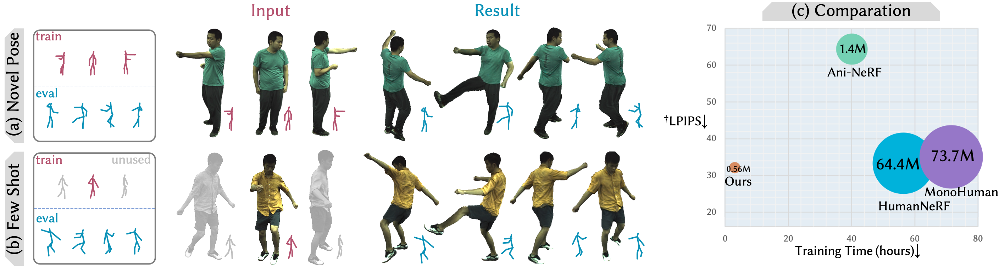

# HumanNeRF-SE
HumanNeRF-SE: A Simple yet Effective Approach to Animate HumanNeRF with Diverse Poses (CVPR2024)

<a href='https://miles629.github.io/humannerf-se.github.io/'></a> <a href='https://arxiv.org/abs/2312.02232'></a> [](link)



## Updates 
The code will be released as soon as possible. I want to provide as comprehensive code as possible for use in the experiment, minimize potential misunderstandings in the code, and provide clear guidance for further development. Basic information has been updated.

## Preparation

Since our code is developed based on HumanNeRF, so we recommend to follow the installation guide of [humannerf](https://github.com/chungyiweng/humannerf) to construct your python environment and download the [SMPL](https://smplify.is.tue.mpg.de/) model. Additionally, [pytorch3d](https://github.com/facebookresearch/pytorch3d) will be helpful to calculate the 3d relationship.

To get the ZJU-Mocap dataset, click [here](https://github.com/zju3dv/neuralbody/blob/master/INSTALL.md#zju-mocap-dataset) to apply for the dataset.

We also recommend to capture a monocular video yourself, and the relevant file~(process-sequence.sh) is modified based on [InstantAvatar](https://github.com/tijiang13/InstantAvatar).  We also provide the visualization code~(visual-pose.py, visual-pose refined.py) to check the result need to be re-process or not. Then use the conversion file~(filetransfer.sh) to make the result suitable for the code, don't foget to change the path in the .sh file.

Use python files in `tools` to split the dataset to any form you want.

## Train& Eval

Make sure all the steps done in Preparation. We provide a sh file~(sh377+GPU1.sh) to tran & evl sub377. Before that you should check path in `dataset_args.py` is the right one to animate the humannerf to any pose you want.

## Citation	

```
@misc{ma2023humannerfse,
      title={HumanNeRF-SE: A Simple yet Effective Approach to Animate HumanNeRF with Diverse Poses}, 
      author={Caoyuan Ma and Yu-Lun Liu and Zhixiang Wang and Wu Liu and Xinchen Liu and Zheng Wang},
      year={2023},
      eprint={2312.02232},
      archivePrefix={arXiv},
      primaryClass={cs.CV}
}
```